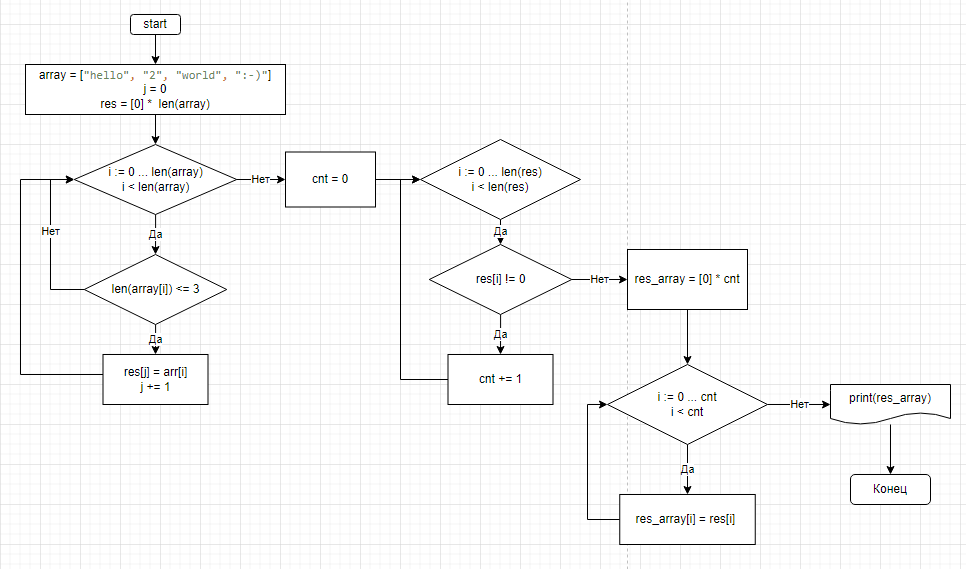

# Итоговая проверочная работа.

1Создать репозиторий на GitHub.
2.Нарисовать блок-схему алгоритма (можно обойтись блок-схемой основной содержательной части, если вы выделяете её в отдельный метод)
3.Снабдить репозиторий оформленным текстовым описанием решения (файл README.md)
4.Написать программу, решающую поставленную задачу
5.Использовать контроль версий в работе над этим небольшим проектом (не должно быть так что все залито одним коммитом, как минимум этапы 2, 3 и 4 должны быть расположены в разных коммитах)

## Задача:
Написать программу, которая из имеющегося массива строк формирует массив из строк, длина которых меньше либо равна 3 символа. Первоначальный массив можно ввести с клавиатуры, либо задать на старте выполнения алгоритма. При решении не рекомендуется пользоваться коллекциями, лучше обойтись исключительно массивами.

### Алгоритм решения:
1. Делаем перебор значений из исходного массива
2. Проверяем каждое значение из массива на соответствие условию: `длина строки меньше или равна трем`
3. Если строка удовлетворяет условию кладем значение в новый массив
4. Повторяем пункты `2` и `3` до тех пор пока не достигнем конца исходного массива
5. Возвращаем новый заполненый массив как результат

Ссылка на репозиторий на GitHub:https://github.com/Kashitsina/ControlWork.git

### Блок-схема алгоритма: 

